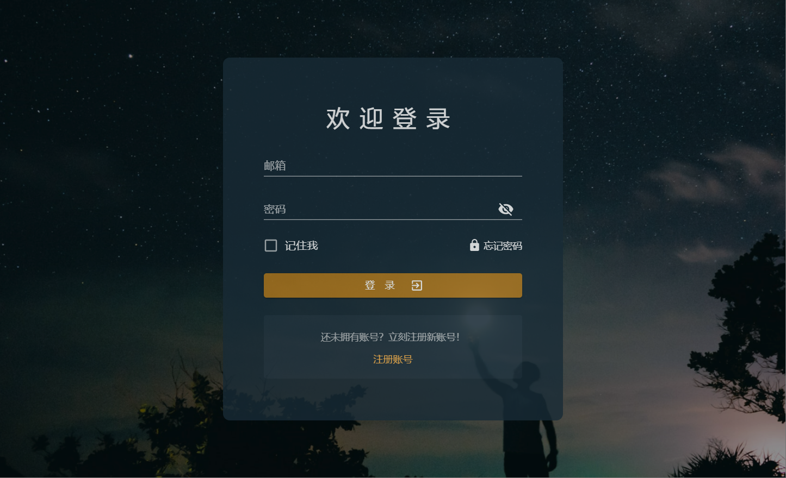
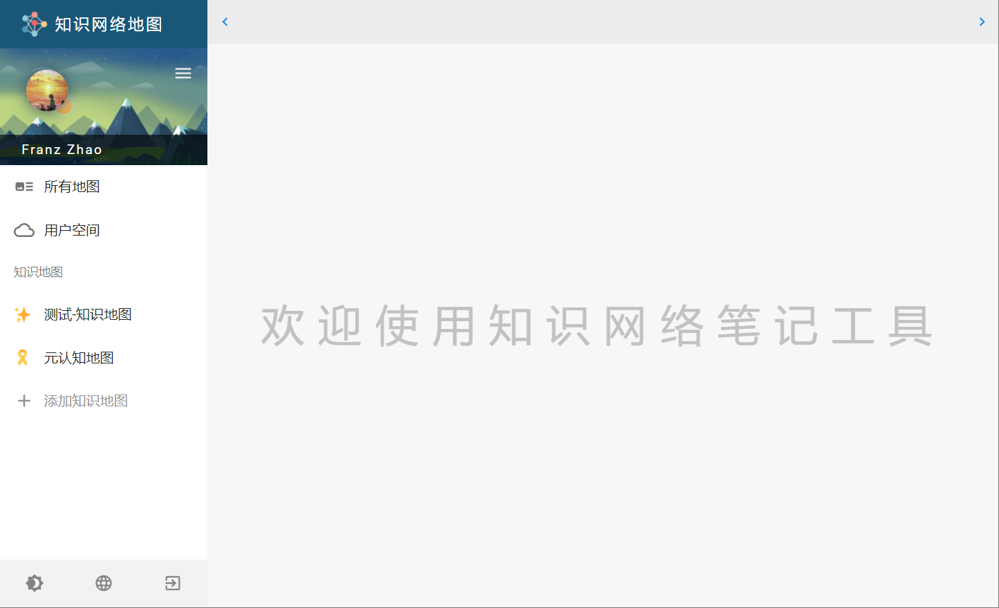
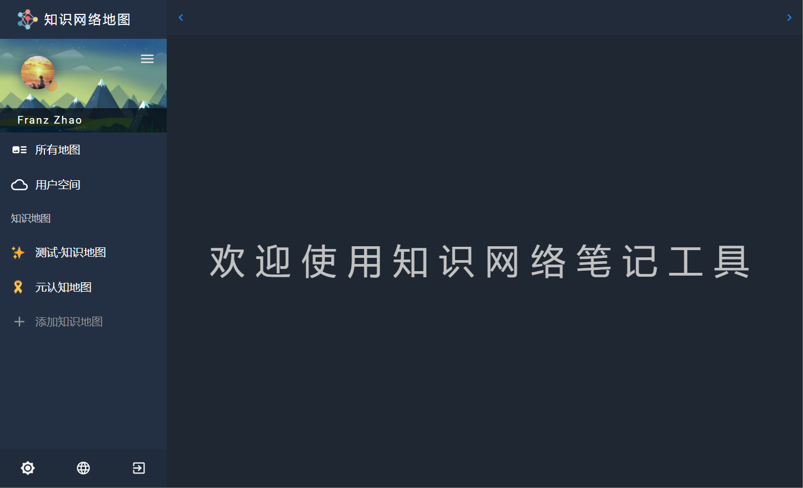
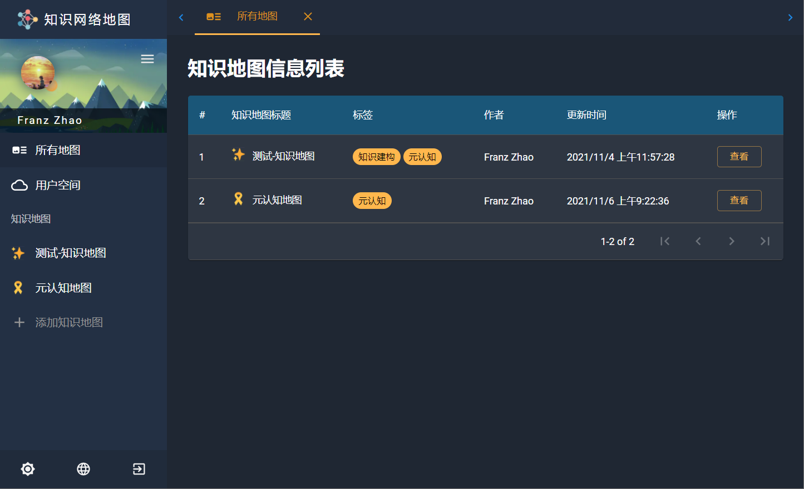
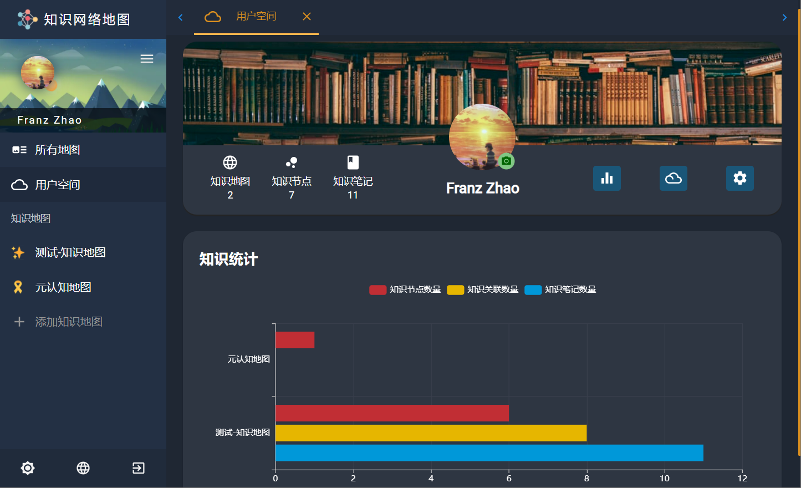
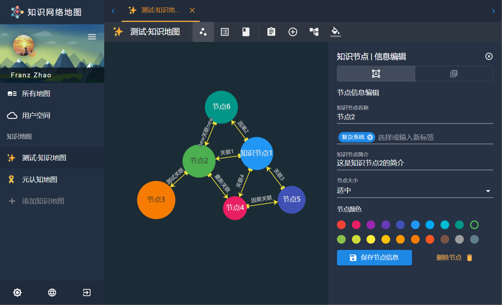
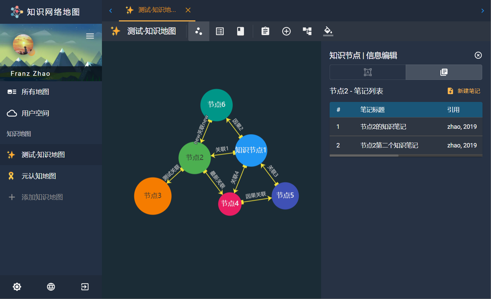
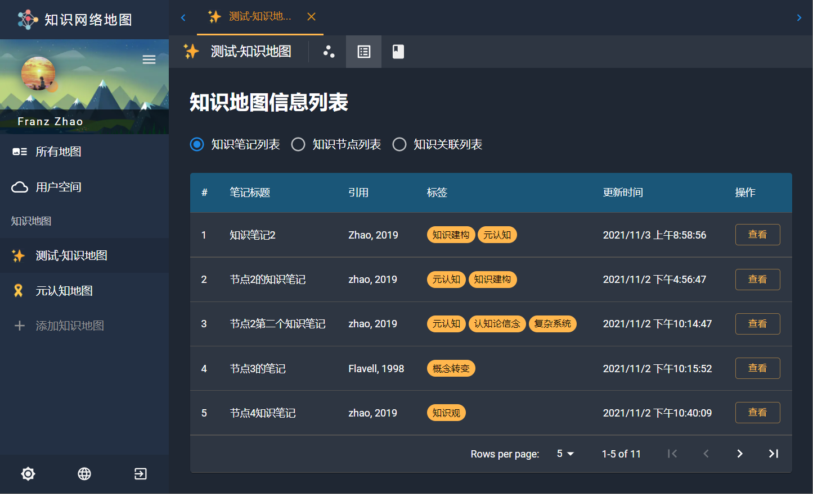
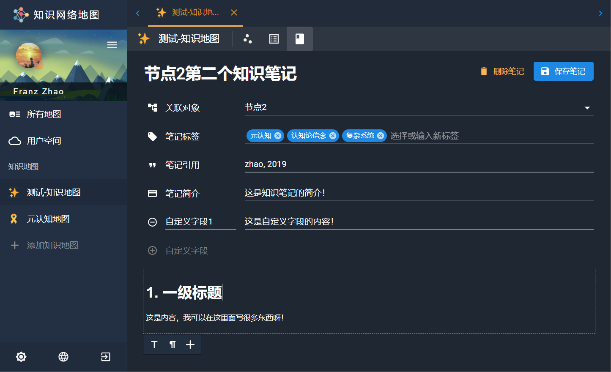

# Knowledge Network Map

## 1. KNM-V1 Introduction

### 1.1. Basic Function

(1) Login Page

(2) Light Mode

(3) Dark Node

(4) knowledge network map (KNM) list

(5) user space page

(6) KNM graph detail page: node information

(7) KNM graph detail page: notebooks that belong to current selected node

(8) KNM notebooks list page

(9) KNM notebook edit page

## 2. Version Log

### 2.1 V1.0: public in 2021/11/06

**Finish the primary function of KNM notebook**: 

(1) about KNM

- check all KNM
- create a new KNM
- delete a exist KNM
- modify a exist KNM's information: title, KNM logo(emoji), KNM introduction & tags
- modify a exist KNM's graph style
  - theme color: background color
  - node style: label size, label position
  - line style: line type, line color, line width, line opacity

(2) about KNM knowledge nodes

- check all KNM nodes
- create a new nodes
- delete a exist nodes (also delete the link that connect with this nodes, and the notebooks in this node)
- modify a exist node's information: title, tags, introduction, node size, node color
- create a notebook belong to specific node
- check all the notebooks that belong to specific node

(3) about KNM knowledge links

- check all KNM links
- create a new link to connect to different nodes
- delete a exist nodes (also delete the notebooks in this link)
- modify a exist link's information: title, tags, introduction, source, target
- create a notebook belong to specific link
- check all the notebooks that belong to specific link

(4) about KNM knowledge notebooks

- check all KNM notebooks
- create a new notebooks: title, tags, quote, introduction, self-defined property, main contain(text)
- delete a exist notebook
- modify a exist notebook

(5) user space

- KNM statics: to calculate the numbers of KNM, nodes, links and notebooks
- user information setting
- diary space: to record the learning diary/log

## 3. 当前计划

- 项目结构优化
- 系统主题色选择（明亮主题+黑暗主题,明亮主题可以更活跃些,现在太淡了,可以参考一些dashboard的论文设计样例）
- 添加标签管理系统
- 使用D3.js的力引导图替代现在echarts的
- 页面布局缩小, 参考postman的布局把组件放得更紧凑一些, 现在有些大
- KNM nodes, links, and notebooks search
- KNM Assistant Agent: an intelligent Learning Tutor Agent
- page tabs function: close all, close others
- 桌面端: 移植到Electron上
- 移动端: 移植到React Native上